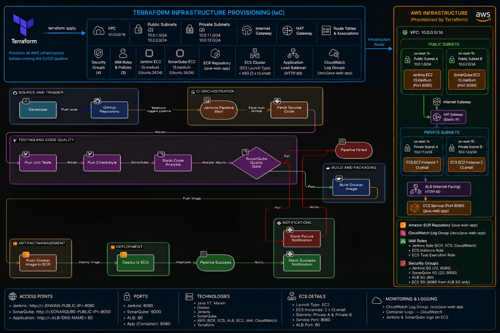
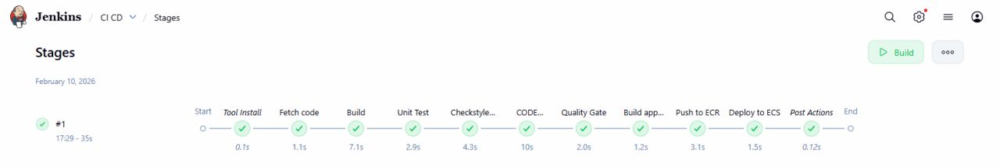
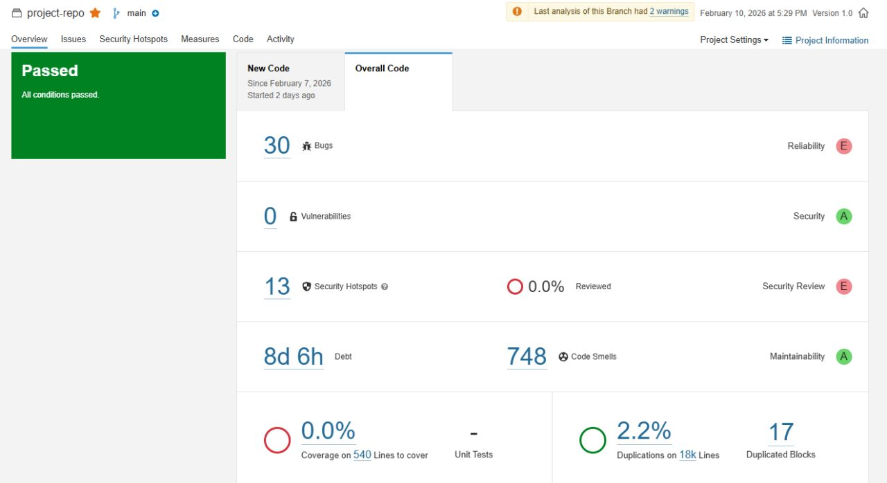
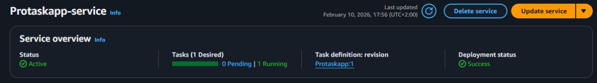
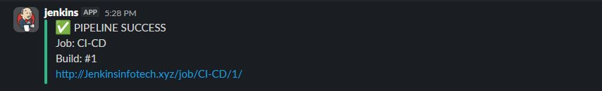
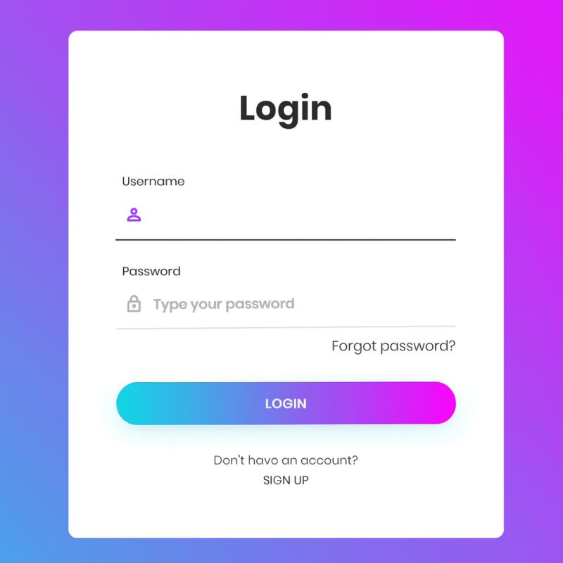

#  VProfile End-to-End CI/CD Pipeline on AWS

## Project Overview

This project demonstrates a complete production-style CI/CD pipeline built around Infrastructure as Code (IaC), code quality enforcement, containerization, and automated deployment to AWS.

The entire environment is provisioned using Terraform, while Jenkins orchestrates the CI/CD workflow from code commit to deployment on Amazon ECS.

The pipeline ensures that every code change passes testing, quality validation, containerization, and deployment stages automatically.

---

## Architecture Diagram



This architecture illustrates an end-to-end DevOps platform built using Terraform, Jenkins, SonarQube, Docker, Amazon ECR, Amazon ECS, and Slack.

### Key Components

* Terraform Infrastructure as Code (IaC)
* Jenkins CI/CD Pipeline
* SonarQube Code Quality Analysis
* Docker Containerization
* Amazon Elastic Container Registry (ECR)
* Amazon Elastic Container Service (ECS)
* AWS IAM Security Integration
* Slack Notifications
* GitHub Webhooks

The infrastructure is automatically provisioned using Terraform, ensuring consistency, repeatability, and scalability.


Infrastructure Provisioning with Terraform

Terraform was used to provision the complete AWS infrastructure required for the CI/CD platform.

### Resources Provisioned

* VPC
* Public and Private Subnets
* Internet Gateway
* Route Tables
* Security Groups
* ECS Cluster
* ECS Service
* ECR Repository
* IAM Roles & Policies
* Application Load Balancer

### Benefits

* Infrastructure Version Control
* Automated Provisioning
* Reproducible Environments
* Reduced Manual Configuration

---

## Jenkins Pipeline



Jenkins serves as the central orchestration engine for the entire CI/CD workflow.

### Pipeline Stages

1. Source Code Checkout
2. Maven Build
3. Unit Testing
4. Checkstyle Validation
5. SonarQube Analysis
6. Quality Gate Verification
7. Docker Image Build
8. Docker Image Tagging
9. Push Image to Amazon ECR
10. Deploy Updated Image to Amazon ECS
11. Slack Notification

The pipeline automatically stops if any quality or validation stage fails.

---

## Code Quality & Static Analysis



SonarQube was integrated into the pipeline to enforce code quality standards before deployment.

### Analysis Performed

* Code Smells Detection
* Bugs Detection
* Vulnerability Scanning
* Maintainability Analysis
* Technical Debt Measurement

### Quality Gate Enforcement

The deployment process is blocked whenever the configured Quality Gate fails.

**No Quality → No Deployment**

---

## Containerization & Image Management

Docker is used to package the application and its dependencies into a portable and consistent runtime environment.

### Docker Workflow

* Build Docker Image
* Apply Version Tags
* Push Image to Amazon ECR
* Pull Image During ECS Deployment

### Benefits

* Consistent Runtime Environment
* Faster Deployments
* Simplified Rollbacks
* Environment Portability

---

## Amazon ECS Deployment



Amazon ECS is used to run and manage application containers.

### Deployment Features

* Automated Service Updates
* Container-Based Deployments
* High Availability
* Load Balanced Traffic Distribution
* Scalable Container Infrastructure

After a successful image push to ECR, Jenkins automatically updates the ECS service to deploy the latest application version.

---

## Slack Notifications



Slack notifications provide immediate feedback about pipeline execution results.

### Notifications Include

* Build Success
* Build Failure
* Deployment Status
* Pipeline Execution Summary

This ensures rapid visibility into deployment activities.

---

# Application

## Login Page



The login page confirms successful deployment of the application through the complete CI/CD pipeline.

Successful access verifies:

* ECS Service Deployment
* Application Load Balancer Routing
* Container Availability
* Backend Connectivity

---

# CI/CD Workflow

```text
Developer Push
        │
        ▼
GitHub Webhook
        │
        ▼
Jenkins Pipeline
        │
        ├── Build
        ├── Unit Tests
        ├── Checkstyle
        ├── SonarQube Analysis
        ├── Quality Gate
        ├── Docker Build
        ├── Push to ECR
        └── Deploy to ECS
                 │
                 ▼
          Running Application
                 │
                 ▼
        Slack Notifications
```

# Security Implementation

### IAM Integration

* Least Privilege Principle
* IAM Roles for ECS
* IAM Policies for ECR Access
* Secure Jenkins Credentials Management

### Security Benefits

* Reduced Attack Surface
* Controlled Resource Access
* Secure Cloud Authentication

---

# Prerequisites

* AWS Account
* Terraform
* Jenkins
* Docker
* SonarQube
* Maven
* Git
* AWS CLI

---

# Technologies Used

* Terraform
* Jenkins
* GitHub
* GitHub Webhooks
* Maven
* SonarQube
* Checkstyle
* Docker
* Amazon ECR
* Amazon ECS
* AWS IAM
* AWS VPC
* Application Load Balancer
* Slack
* Java
* Spring MVC
* MySQL

---

# Key Learning Outcomes

* Infrastructure as Code using Terraform
* Automated CI/CD Pipeline Design
* Jenkins Pipeline Development
* SonarQube Integration
* Containerization with Docker
* AWS ECR Image Management
* ECS Container Deployments
* Secure IAM-Based Access Control
* Deployment Automation
* DevOps Best Practices

# Prerequisites
#
- JDK 17 
- Maven 3.9 
- MySQL 8

# Technologies 
- JAKARTA
- Spring MVC
- Spring Security
- Spring Data JPA
- Maven
- JSP
- Tomcat
- MySQL
- Memcached
- Rabbitmq
- ElasticSearch
# Database
Here,we used Mysql DB 
sql dump file:
- /src/main/resources/db_backup.sql
- db_backup.sql file is a mysql dump file.we have to import this dump to mysql db server
- > mysql -u <user_name> -p accounts < db_backup.sql


